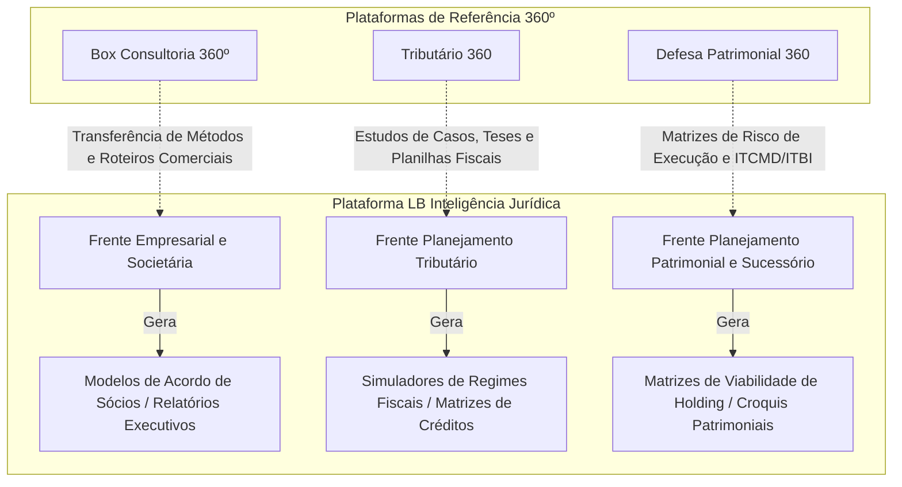
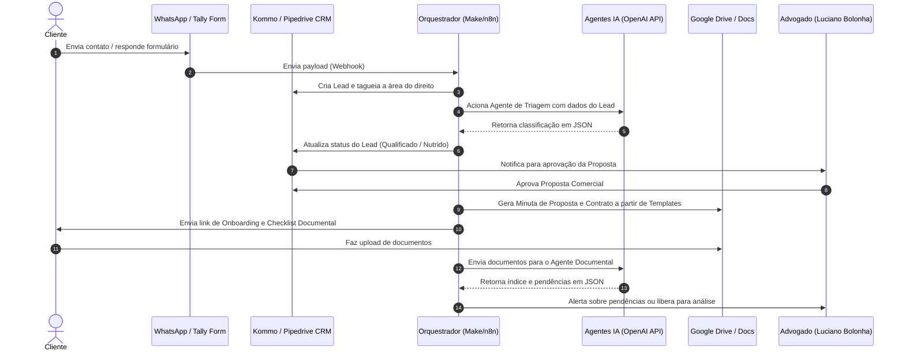
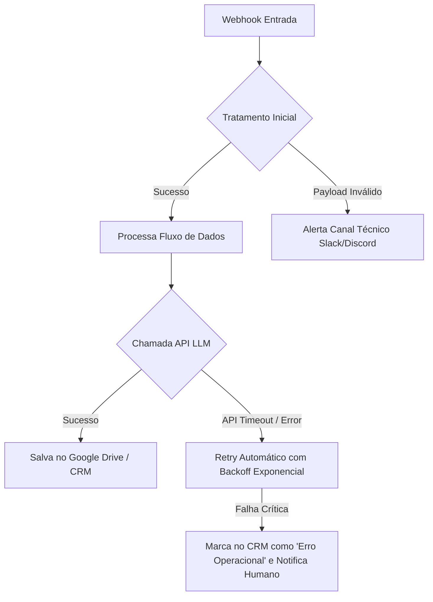

# Software Design Document (SDD) - Master
## Plataforma Operacional LB Inteligência Jurídica

**Data:** 2026-05-28  
**Autor:** Desenvolvedor Sênior / Especialista em SDD  
**Projeto:** Plataforma Digital Enxuta de Advocacia Autônoma  
**Status:** Pronto para Implementação  

---

## 1. Introdução e Visão Geral

A plataforma **LB Inteligência Jurídica** é o ecossistema operacional de um escritório de advocacia 100% digital, focado em alta performance e escalabilidade operacional. O sistema foi desenhado para atuar de forma leve (low-code/no-code), utilizando Inteligência Artificial como copiloto estratégico sob estrita governança humana (*Human-in-the-loop*).

### 1.1 Áreas de Atuação Centrais
- **Planejamento Patrimonial e Sucessório:** Proteção patrimonial em vida, estruturação sucessória e holding familiar.
- **Planejamento Tributário:** Elisão fiscal, análise de regimes tributários (Simples Nacional, Lucro Presumido, Lucro Real) e transição para a Reforma Tributária.
- **Planejamento Empresarial e Societário:** Governança preventiva, acordos de sócios, blindagem societária e contratos de negócios.

### 1.2 Objetivos de Engenharia do Sistema
1. **Zero Papel e 100% Cloud:** Armazenamento seguro e organização lógica de documentos de clientes.
2. **IA-Driven Workflow:** Copilotos de IA especializados integrados em etapas de triagem, diagnóstico e produção documental.
3. **Escalabilidade Sem Contratações em Massa:** Permitir que uma equipe reduzida gerencie dezenas de projetos simultâneos com alto padrão de qualidade jurídica.
4. **Governança e Rastreabilidade:** Registro sistemático de premissas, riscos, decisões humanas e histórico de versões.

---

## 2. Correlação e Integração das Plataformas 360º

O ecossistema operacional da LB Inteligência Jurídica se correlaciona e integra metodologicamente os materiais, ferramentas e lógicas de três plataformas de referência da marca **Super Inteligência [IA]**:



### 2.1 Box Consultoria Empresarial 360º
- **Correlação:** Fornece o arcabouço metodológico de gestão, vendas consultivas e diagnóstico de processos corporativos.
- **Integração Técnica:**
  - Adaptação do roteiro comercial de 10 blocos na triagem e onboarding da LB (`docs/templates/comercial/roteiro-comercial-empresarial-societario-360.md`).
  - Uso dos conceitos do Canvas de Consultoria para estruturação dos planos de ação societários (`docs/operacao/plano-acao-empresarial-societario-360.md`).
  - Utilização dos templates de proposta comercial focados em agregação de valor empresarial.

### 2.2 Tributário 360
- **Correlação:** Base técnica de teses fiscais, recuperação administrativa, simulação de regimes de impostos e adaptação preventiva para a Reforma Tributária (IBS/CBS e Split Payment).
- **Integração Técnica:**
  - Matriz de integração técnica do portal (`docs/referencias/tributario-360-matriz-de-integracao.md`).
  - Simulador de comparação de regimes tributários em JS/Markdown para diagnóstico rápido (`docs/metricas/simulador-comparacao-regimes-tributarios.md`).
  - Checklists de conformidade e playbooks de compliance recorrente baseados na operação do portal.

### 2.3 Defesa Patrimonial 360
- **Correlação:** Arcabouço de defesa contra constrições (SISBAJUD, RENAJUD, CNIB) e estruturação preventiva (Holding Familiar, Integralização de Bens, Doação com Usufruto e Testamentos).
- **Integração Técnica:**
  - Matriz de incorporação de holding e planejamento sucessório (`docs/referencias/holding-360-matriz-de-incorporacao.md`).
  - Simulador financeiro-patrimonial comparativo (Doação vs. Inventário vs. Holding) (`docs/metricas/simulador-financeiro-patrimonial-360.md`).
  - Matriz de viabilidade para avaliar custo-benefício da constituição de holdings (`docs/operacao/matriz-viabilidade-holding.md`).

---

## 3. Arquitetura do Sistema e Fluxo de Dados

A arquitetura técnica é baseada em microsserviços integrados via API (REST/JSON) orquestrados por uma ferramenta central de integração (Make ou n8n).



### 3.1 Camadas do Sistema
1. **Interface e Canais de Entrada:** WhatsApp Business API (via provedor Z-API/Evolution API) ou formulário digital (Tally/Typeform) para preenchimento de pré-diagnósticos.
2. **Orquestrador de Fluxos (Integration Layer):** Cenários Make/n8n que escutam webhooks, processam strings, realizam chamadas de API de LLM e atualizam os bancos de dados.
3. **Gestão de Relacionamento (CRM):** Kommo ou Pipedrive, gerenciando o pipeline em 10 etapas da jornada do cliente.
4. **Camada de IA (Cognitive Services):** Chamadas à API da OpenAI (GPT-4o) ou Anthropic (Claude 3.5 Sonnet) configuradas com prompts sistêmicos especializados para cada etapa.
5. **Gestão de Arquivos (Storage Layer):** Estrutura de pastas automatizada no Google Drive/OneDrive, dividida em: `/leads-triagem/`, `/onboarding/`, `/documentos-clientes/`, `/entregas-revisao/`, `/entregas-aprovadas/`.
6. **Interface de Assinatura e Formalização:** Integração via API Clicksign ou DocuSign para assinatura do contrato de honorários.

---

## 4. Modelo de Dados (JSON Schema)

Para garantir integridade técnica entre as integrações de API, os dados são padronizados através de schemas JSON.

### 4.1 Schema de Lead e Qualificação (Estágios 1 e 2)
```json
{
  "$schema": "http://json-schema.org/draft-07/schema#",
  "title": "LeadQualificacao",
  "type": "object",
  "properties": {
    "lead_id": { "type": "string" },
    "nome_cliente": { "type": "string" },
    "tipo_pessoa": { "type": "string", "enum": ["PF", "PJ", "Misto"] },
    "area_provavel": { "type": "string", "enum": ["patrimonial", "tributaria", "empresarial", "mista"] },
    "detalhes_patrimonio": {
      "type": "object",
      "properties": {
        "imoveis_valor": { "type": "number" },
        "empresas_valor": { "type": "number" },
        "investimentos_valor": { "type": "number" }
      },
      "required": ["imoveis_valor", "empresas_valor"]
    },
    "urgencia_fiscal": { "type": "boolean" },
    "conflito_familiar": { "type": "boolean" },
    "status_qualificacao": { "type": "string", "enum": ["qualificado", "nutrir", "recusar", "redirecionar"] },
    "motivo_status": { "type": "string" },
    "mensagem_resposta_sugerida": { "type": "string" }
  },
  "required": ["lead_id", "nome_cliente", "tipo_pessoa", "area_provavel", "status_qualificacao"]
}
```

### 4.2 Schema da Pasta Documental (Estágio 6)
```json
{
  "$schema": "http://json-schema.org/draft-07/schema#",
  "title": "PastaDocumental",
  "type": "object",
  "properties": {
    "cliente_id": { "type": "string" },
    "contrato_id": { "type": "string" },
    "status_onboarding": { "type": "string", "enum": ["iniciado", "documentos_pendentes", "pronto_para_analise"] },
    "documentos_recebidos": {
      "type": "array",
      "items": {
        "type": "object",
        "properties": {
          "id_arquivo": { "type": "string" },
          "nome_arquivo": { "type": "string" },
          "categoria": { "type": "string" },
          "url_drive": { "type": "string" },
          "tamanho_bytes": { "type": "integer" }
        },
        "required": ["id_arquivo", "nome_arquivo", "categoria", "url_drive"]
      }
    },
    "pendencias_criticas": {
      "type": "array",
      "items": { "type": "string" }
    }
  },
  "required": ["cliente_id", "status_onboarding", "documentos_recebidos", "pendencias_criticas"]
}
```

### 4.3 Schema do Parecer de Análise Técnica (Estágio 7)
```json
{
  "$schema": "http://json-schema.org/draft-07/schema#",
  "title": "ParecerAnaliseTecnica",
  "type": "object",
  "properties": {
    "analise_id": { "type": "string" },
    "cliente_id": { "type": "string" },
    "resumo_executivo_dor": { "type": "string" },
    "riscos_mapeados": {
      "type": "array",
      "items": {
        "type": "object",
        "properties": {
          "categoria": { "type": "string" },
          "descricao": { "type": "string" },
          "criticidade": { "type": "string", "enum": ["alta", "media", "baixa"] }
        },
        "required": ["categoria", "descricao", "criticidade"]
      }
    },
    "estrategias_propostas": {
      "type": "array",
      "items": { "type": "string" }
    },
    "limitacoes_e_premissas": {
      "type": "array",
      "items": { "type": "string" }
    },
    "responsavel_revisao_humana": { "type": "string" }
  },
  "required": ["analise_id", "cliente_id", "resumo_executivo_dor", "riscos_mapeados", "estrategias_propostas", "limitacoes_e_premissas", "responsavel_revisao_humana"]
}
```

---

## 5. Engenharia dos Agentes de IA

Cada agente opera sob o modelo de prompt estruturado contendo: Missão, Entradas, Saídas, Limites e Prompt Base. A segurança lógica é implementada impedindo que a IA altere o fluxo ou tome decisões finais sem revisão humana.

### 5.1 Agentes Ativos e Mapeamento de Estágios
1. **Agente de Recepção e Registro (Estágio 1):** Analisa primeiras mensagens do WhatsApp/Tally e categoriza o interesse do lead.
2. **Agente de Triagem Comercial (Estágio 2):** Qualifica o lead com base nas respostas de patrimônio, faturamento e urgência jurídica.
3. **Agente de Diagnóstico Empresarial/Societário (Estágio 3):** Lê o questionário inicial e identifica atritos contratuais, riscos de retirada, e desalinhamentos de governança.
4. **Agente de Diagnóstico Tributário (Estágio 3):** Mapeia CNAE, regimes fiscais e oportunidades preliminares de elisão fiscal.
5. **Agente de Diagnóstico Patrimonial (Estágio 3):** Constrói a primeira visão de árvore familiar e distribuição de patrimônio imóvel/móvel.
6. **Agente de Propostas Comerciais (Estágio 4):** Redige propostas com escopo, prazos, limites contratuais e honorários parametrizados.
7. **Agente Documental (Estágio 6):** Realiza a leitura e classificação lógica de PDFs de IRPF, matrículas, e contratos sociais, apontando lacunas.
8. **Agente de Estratégia Jurídica (Estágio 7):** Avalia as opções cabíveis (Exemplo: Holding vs. Doação com Usufruto) com base na base de conhecimento interna.
9. **Agente de Minutas (Estágio 8):** Gera o rascunho de contratos, acordos de sócios e pareceres a partir de templates estruturados.
10. **Agente de Revisão de Qualidade e Clareza (Estágio 9):** Audita o documento final contra alucinações, termos em juridiquês excessivo e checa contra o checklist de conformidade.

---

## 6. Pipeline de Integração e Gestão de Erros

A resiliência operacional é garantida por meio de tratamento de exceções estruturado nos cenários do orquestrador.



### 6.1 Política de Retentativas e Logs
- **Backoff Exponencial:** Integrações de API externas (OpenAI, CRM, Z-API) possuem até 3 retentativas automáticas em caso de erros `5xx` ou timeouts.
- **Fail-safe Humano:** Caso uma IA falhe ou retorne dados fora do schema esperado, o orquestrador bloqueia o avanço da oportunidade no CRM, cria uma tarefa urgente de "Correção Manual de Integração" e notifica o administrador via canal de controle.

---

## 7. Segurança, LGPD e Privacidade

O tratamento de dados patrimoniais, societários e de imposto de renda exige conformidade rígida com a Lei Geral de Proteção de Dados (LGPD).

### 7.1 Requisitos de Segurança
1. **Segregação de Dados:** Documentos originais de clientes não são enviados para treino de modelos públicos de IA (as chamadas de API são feitas via endpoints corporativos da OpenAI que garantem zero retenção para treino).
2. **Criptografia:** Todo tráfego é realizado via HTTPS/TLS. Os arquivos no Google Drive corporativo da LB possuem autenticação de dois fatores obrigatória para todos os usuários autorizados.
3. **Políticas de Expiração:** Documentos de leads não convertidos em 90 dias são arquivados fisicamente e excluídos da nuvem operacional após notificação.
4. **Acordo de Confidencialidade (NDA):** Toda proposta e pré-diagnóstico é acompanhado de termos explícitos de confidencialidade de dados.

---

## 8. Infraestrutura e Custos Operacionais Estimados (MVP)

A infraestrutura foi pensada para gerar o menor custo fixo possível, mantendo a robustez técnica.

| Camada | Ferramenta | Tipo | Custo Estimado (Mensal) |
| --- | --- | --- | --- |
| Canais e Atendimento | Evolution API + WhatsApp | Low-code | R$ 80,00 |
| CRM | Kommo CRM (Plano Básico) | SaaS | R$ 120,00 / usuário |
| Orquestração | n8n (Cloud) ou Make | Low-code | R$ 110,00 |
| IA Cognitiva | OpenAI API (GPT-4o) | API (Pay-as-you-go) | R$ 50,00 - R$ 150,00 (por uso) |
| Armazenamento | Google Workspace Business | SaaS | R$ 60,00 / usuário |
| Assinatura Digital | Clicksign | SaaS | R$ 50,00 |
| **Custo Fixo Total Estimado**| | | **~ R$ 470,00 a R$ 570,00 / mês** |

---

Este documento serve como mapa de engenharia para qualquer desenvolvedor ou orquestrador que assuma a codificação técnica das integrações e provisionamento da plataforma LB Inteligência Jurídica.
